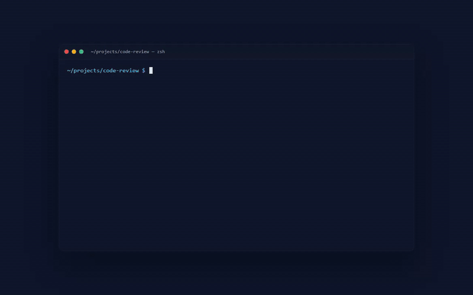
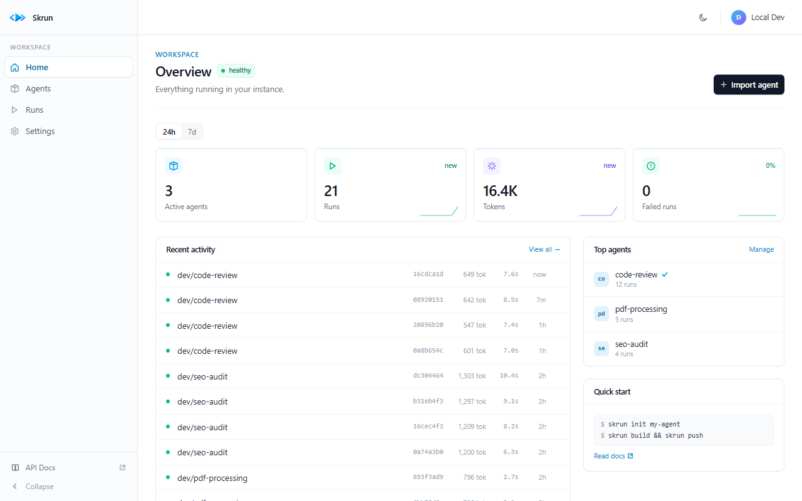

<p align="center">
  
</p>

<h1 align="center">Skrun</h1>

<p align="center">
  <b>Deploy any Agent as an API via <code>POST /run</code>.</b><br>
  The open, multi-model runtime for AI agents — works with any LLM, on any infrastructure.
</p>

<p align="center">
  <sub>The open-source alternative to Claude Managed Agents (CMA) and Google's
  Gemini Enterprise Agent Platform (GEAP) — multi-model, self-hostable, MIT.</sub>
</p>

<p align="center">
  <a href="https://github.com/skrun-dev/skrun/actions"></a>
  <a href="https://www.npmjs.com/package/@skrun-dev/cli"></a>
  <a href="https://www.npmjs.com/package/@skrun-dev/sdk"></a>
  <a href="https://github.com/skrun-dev/skrun/stargazers"></a>
  <a href="LICENSE"></a>
</p>

<p align="center">
  
  
  
</p>

<p align="center">
  <a href="#-why-skrun">Why</a> ·
  <a href="#️-use-cases">Use Cases</a> ·
  <a href="#-quick-start">Quick Start</a> ·
  <a href="#-dashboard">Dashboard</a> ·
  <a href="#-sdk">SDK</a> ·
  <a href="#-features">Features</a> ·
  <a href="#-documentation">Docs</a>
</p>

<p align="center">
  
</p>

<p align="center"><sub>
  <b>4 steps:</b> (1) <code>skrun deploy -m "initial release"</code> from your terminal →
  (2) the agent appears in the dashboard →
  (3) open the Playground, fill the input →
  (4) click Run, watch SSE events stream in real time, see the result.
</sub></p>

---

## 🎯 Why Skrun?

You shipped an AI capability. It works on your machine. But every user, every customer, every new model brings new plumbing.

**Skrun is the open agent runtime.** Turn your skill — declared as `SKILL.md`, `AGENTS.md`, or your own format — into a `POST /run` endpoint. Without building your own agent loop. Without picking a vendor. Without locking your users behind a wall.

**Any model. Any cloud. BYOK. MIT.** Your skill stays portable.

### What you get

- ✅ Your skill stays in your repo, in the format you choose. Skrun is a deployment target — your repo stays the source of truth.
- ✅ Compatible with the [Agent Skills open standard](https://agentskills.io) (`SKILL.md`) and [AGENTS.md](https://agents.md) (Linux Foundation). Your existing skill works.
- ✅ Users bring their own LLM keys. You're never on the hook for their costs.
- ✅ Self-host on your infrastructure (Node 20+, SQLite or Postgres). [Self-hosting guide](docs/self-hosting.md). Cloud (coming soon).
- ✅ MIT. Multi-model: Claude, GPT, Gemini, Mistral, Groq, Ollama.
- ✅ Wrap existing scripts gradually. No big-bang rewrite required.

### Skrun vs vendor runtimes

| | Skrun | CMA / GEAP / Vendor runtimes |
|--|-------|-----------------|
| **Models** | Claude, GPT, Gemini, Mistral, Groq + any OpenAI-compatible endpoint (DeepSeek, Kimi, Qwen, Ollama, vLLM…) | One provider only |
| **Deployment** | Self-hosted (Node + SQLite/Postgres) or our cloud (coming soon) | Vendor cloud only |
| **Format** | `SKILL.md` ([agentskills.io](https://agentskills.io), 40+ platforms), `AGENTS.md` ([Linux Foundation](https://agents.md)), or your own | Proprietary |
| **Streaming** | SSE + async webhooks | Varies |
| **License** | MIT | Closed |
| **Auth** | GitHub OAuth + API keys — multi-tenant namespaces | Vendor console only |
| **LLM keys** | Bring your own keys | Vendor billing only |

---

## 🏗️ Use Cases

### 🚀 For OSS skill maintainers — close the issues you can't answer today

You wrote `changelog-generator` (or `research-to-brief`, or `incident-postmortem`). It works in Claude Code. Stars are climbing. Then someone opens issue #34: *"How do I run this from a CI pipeline?"* Issue #41: *"Can I integrate this with Linear?"* Issue #58: *"My status-page automation needs this."*

Today you respond: *"Sorry, this is a SKILL.md — you need Claude Code installed."* Half abandon.

**With Skrun:** `skrun deploy`, you reply with a curl command. Issue closed in 5 minutes instead of 3 hours of setup. The drop-off between "starred it" and "actually running it" disappears.

### 🛠️ For internal AI platforms — visibility and standardization without rewriting

Your team has accumulated 12 LLM-powered scripts in 2 years. Each engineer rolled their own. One left last week — three of his scripts are crashing silently. Your LLM bill went 5x without explanation. The board asked twice "what's our AI strategy?" — you don't have one.

**With Skrun:** wrap existing scripts gradually as skills (or `AGENTS.md`, or your own format). No big-bang rewrite. One dashboard for all AI calls — cost per feature, failure modes, ownership. Your team standardizes on one declarative format. New engineers read a manifest in 30 seconds instead of reverse-engineering 800 lines.

### 🎯 For freelance & agencies — stop bricolating per-client AI deliveries

Each new client means 2-3 weeks of build. You glue Express + Anthropic SDK + Vercel for each delivery. The plumbing is identical 70% of the time. Worse: when a client wants to switch from Anthropic to OpenAI 3 months later, you're back rewriting auth + retry + fallback logic.

**With Skrun:** same skill format, deploy per client. Model swap is a YAML edit. Your client gets a stable `POST /run` endpoint **they own** — they can host on their infra, swap models, take over anytime. You ship the skill, not a server you maintain.

---

## 💬 What would *you* deploy?

What skill would you turn into an API tomorrow? What's missing in your current agent setup?

**[Tell us in Discussions](https://github.com/skrun-dev/skrun/discussions)** — we read every post, and it shapes the roadmap.

---

## 🚀 Quick Start

```bash
npm install -g @skrun-dev/cli

skrun init --from-skill ./my-skill    # or: skrun init my-agent
skrun deploy -m "initial release"     # build + push + get your API URL
```

That's it. Your agent is now callable via `POST /run`:

```bash
curl -X POST http://localhost:4000/api/agents/dev/my-skill/run \
  -H "Authorization: Bearer dev-token" \
  -H "Content-Type: application/json" \
  -d '{"input": {"query": "analyze this"}}'
```

> `dev-token` is for local development. In production, authenticate via [GitHub OAuth or API keys](docs/api.md#authentication) — your GitHub username becomes your namespace.

→ **[10-minute tutorial](docs/getting-started.md)** · **[Concepts](docs/concepts.md)** · **[API reference](docs/api.md)**

---

## 📊 Dashboard

<p align="center">
  
</p>

Every Skrun registry ships with a full operator dashboard at `/dashboard`. No separate install, no extra env var.

- **Home** — workspace stats, 24h/7d toggles, recent activity, top agents.
- **Agents** — sortable list with run counts, token usage, verification status.
- **Agent detail** — per-agent metrics, versions with notes, metadata, try-it curl.
- **Runs** — every execution across all agents, filterable by agent/ID/status/model.
- **Run detail** — full I/O, tokens, cost, model, event timeline (tool calls, LLM calls).
- **Playground** — call any agent interactively, watch SSE events live, save outputs.
- **Settings** — profile + API keys (`sk_live_*`) with one-shot reveal and revocation.

→ **[Screenshot tour of all 7 pages](docs/getting-started.md#6-explore-the-dashboard)**

---

## 📦 SDK

```bash
npm install @skrun-dev/sdk
```

```typescript
import { SkrunClient } from "@skrun-dev/sdk";

const client = new SkrunClient({
  baseUrl: "http://localhost:4000",
  token: "dev-token",
});

// Sync — get the result
const result = await client.run("dev/code-review", { code: "const x = 1;" });
console.log(result.output);

// Stream — real-time events
for await (const event of client.stream("dev/code-review", { code: "..." })) {
  console.log(event.type); // run_start, tool_call, llm_complete, run_complete
}

// Async — fire and forget with webhook callback
const { run_id } = await client.runAsync("dev/agent", input, "https://your-app.com/hook");

// Pin a specific agent version — reproducible, no silent drift
const pinned = await client.run("dev/code-review", input, { version: "1.2.0" });
console.log(pinned.agent_version); // "1.2.0" — always echoed back

// Push with a note (like a git commit message)
await client.push("dev/code-review", bundle, "1.3.0", { message: "Added retry logic" });
```

9 methods: `run`, `stream`, `runAsync`, `push`, `pull`, `list`, `getAgent`, `getVersions`, `verify`. **Zero runtime dependencies**, Node.js 20+.

---

## ✨ Features

| Feature | Description |
|---------|-------------|
| 🤖 **Multi-model** | 5 built-in providers + any OpenAI-compatible endpoint (DeepSeek, Kimi, Qwen, Ollama, vLLM…) — with automatic fallback |
| 🔧 **Tool calling** | Local scripts (`scripts/`) + MCP servers (`npx`) — same ecosystem as Claude Desktop |
| 💾 **Stateful** | Agents remember across runs via key-value state |
| 📡 **Streaming** | SSE real-time events (`run_start` → `tool_call` → `run_complete`) + async webhooks |
| 📦 **Typed SDK** | `npm install @skrun-dev/sdk` — `run()`, `stream()`, `runAsync()` + 6 more methods |
| 📊 **Operator Dashboard** | Web UI at `/dashboard` — agents, runs, stats, settings, integrated playground with SSE streaming |
| 📖 **Interactive API docs** | OpenAPI 3.1 schema + Scalar explorer at `GET /docs` |
| 🔐 **Production auth** | GitHub OAuth login + API keys (`sk_live_*`) + multi-tenant namespaces |
| 🗄️ **Persistent storage** | Pluggable database — SQLite for local dev (zero-config, file-based), Supabase PostgreSQL for production |
| 🔑 **Caller keys** | Users bring their own LLM keys via `X-LLM-API-Key` — zero cost for operators |
| ✅ **Agent verification** | Verified flag controls script execution — safe for third-party agents |
| 📌 **Version pinning + notes** | Pin a specific agent version per call (`version: "1.2.0"`) or attach a note at push (`-m "..."`) — reproducible integrations, visible changelog |
| 🌍 **Environment separation** | Agent behavior (model, tools) separated from runtime environment (networking, timeout, sandbox). Per-run overrides via POST /run body |
| 📁 **Files API** | Agents produce files (PDF, images, data) — callers download via `GET /api/runs/:run_id/files/:filename` |
| 📊 **Structured logs** | JSON to stdout via pino — pipe to Axiom, Datadog, ELK. `LOG_LEVEL` env var controls verbosity |

---

## 🧪 Demo agents

Eight runnable demos under [`agents/`](./agents/) — each produces a real, downloadable artifact (PDF, XLSX, PPTX, ZIP, CSV, MD). All use Google Gemini Flash by default (free tier). Change the `model` section in `agent.yaml` to use any [supported provider](#-features).

### For OSS developers

| Agent | What it does | Artifact |
|-------|--------------|----------|
| 📝 [changelog-generator](agents/changelog-generator/) | Reads your local `git log` between two tags, groups commits by Conventional Commit type, drafts release notes | `CHANGELOG.md` + `release-notes.md` |
| 📐 [adr-writer](agents/adr-writer/) | Captures an architectural decision (context / options / decision / consequences) as a numbered Markdown ADR — auto-numbers from your existing `adrs/` folder | `NNNN-<slug>.md` |

### For internal-platform / engineering teams

| Agent | What it does | Artifact |
|-------|--------------|----------|
| 🎯 [meeting-transcript-to-action-items](agents/meeting-transcript-to-action-items/) | Extracts decisions + action items from a Zoom/Teams transcript. **Stateful** — auto-resolves prior actions when next meeting mentions them as done | `actions.csv` + `recap.md` |
| 🛡️ [semgrep-rule-creator](agents/semgrep-rule-creator/) | Turns a CVE description + bad-code snippet into a complete Semgrep rule bundle (rule + tests + rationale) | `rule.yml` + `tests.md` + `README.md` |

### For freelancers / analysts / biz operators

| Agent | What it does | Artifact |
|-------|--------------|----------|
| 📊 [csv-to-executive-report](agents/csv-to-executive-report/) | CSV → analyzed multi-page PDF with charts + narrative + summary table | `report.pdf` |
| 🎤 [slide-deck-generator](agents/slide-deck-generator/) | Markdown outline → polished `.pptx` with brand color, title/content/closing layouts, speaker notes | `deck.pptx` |
| 🧾 [receipts-to-expenses](agents/receipts-to-expenses/) | Folder of receipt text files + optional bank statement → categorized expense workbook + summary PDF | `expenses.xlsx` + `monthly.pdf` |

### Universal

| Agent | What it does | Artifact |
|-------|--------------|----------|
| 🧠 [knowledge-base-from-vault](agents/knowledge-base-from-vault/) | Folder of Markdown notes (Obsidian/Notion/raw) → navigable static HTML site. **Stateful** — concept index densifies across runs | `kb.zip` (HTML+CSS) |

<details>
<summary><b>Earlier minimal demos</b></summary>

Shorter examples that each illustrate one primitive (model fallback, MCP, state, scripts) without producing artifacts:

[code-review](agents/code-review/) · [pdf-processing](agents/pdf-processing/) · [seo-audit](agents/seo-audit/) · [data-analyst](agents/data-analyst/) · [email-drafter](agents/email-drafter/) · [web-scraper](agents/web-scraper/)

</details>

<details>
<summary><b>Try one locally</b></summary>

```bash
# 1. Start the registry (uses SQLite — data persists across restarts)
cp .env.example .env          # add your GOOGLE_API_KEY
pnpm dev:registry              # keep this terminal open

# 2. In another terminal — pick any agent (changelog-generator is the lightest)
skrun login --token dev-token
cd agents/changelog-generator
skrun build && skrun push -m "v1 — first push"

# 3. Call it (uses the bundled fixture — no real git repo needed)
curl -X POST http://localhost:4000/api/agents/dev/changelog-generator/run \
  -H "Authorization: Bearer dev-token" \
  -H "Content-Type: application/json" \
  -d '{"input": {"repo_path": "./fixtures/sample-repo.git-log.txt", "project_name": "demo"}}'

# 4. Download the artifacts via the Files API (run_id from response)
curl http://localhost:4000/api/runs/<run_id>/files/CHANGELOG.md \
  -H "Authorization: Bearer dev-token" -o CHANGELOG.md
```

> **Windows (PowerShell):** use `curl.exe` instead of `curl`, and pass `-d "@input.json"` for the body.
> **Python demos** (slide-deck-generator, csv-to-executive-report, receipts-to-expenses): run `pip install -r requirements.txt` once in the agent's directory before pushing.

</details>

---

## 💻 CLI

| Command | Description |
|---------|-------------|
| `skrun init [dir]` | Create a new agent |
| `skrun init --from-skill <path>` | Import existing skill |
| `skrun dev` | Local server with POST /run (mock, free) |
| `skrun test` | Run agent tests (real LLM) |
| `skrun build` | Package `.agent` bundle |
| `skrun push -m "note"` | Push with a version note |
| `skrun deploy -m "note"` | Build + push + live URL |
| `skrun pull <agent>` | Download agent bundle |
| `skrun login` / `logout` | Authentication (OAuth or token) |
| `skrun logs <agent>` | Execution logs (planned) |

→ **[Full CLI reference](docs/cli.md)**

---

## 🌐 Self-hosting

Skrun is MIT — deploy anywhere.

- **SQLite (default)** — zero config, file-based, survives restarts. Good for local dev and single-node.
- **Supabase** — production-grade PostgreSQL. Set `DATABASE_URL` + `SUPABASE_KEY`.
- **Any cloud** — Fly.io, AWS, GCP, Hetzner, bare metal. Caddy or nginx in front.
- **GitHub OAuth** — users sign in with GitHub, their username becomes their namespace.

→ **[Self-hosting guide](docs/self-hosting.md)** — step-by-step with env vars, reverse proxy, migrations.

---

## 📚 Documentation

- 📖 **[Getting Started](docs/getting-started.md)** — 10-minute tutorial with dashboard screenshots
- 🧠 **[Concepts](docs/concepts.md)** — vocabulary reference (agent, skill, run, namespace…)
- 🌐 **[Self-hosting](docs/self-hosting.md)** — deploy on your own infrastructure
- 🔧 [agent.yaml](docs/agent-yaml.md) · [CLI](docs/cli.md) · [API](docs/api.md) — full references
- 🎮 [Interactive API explorer](http://localhost:4000/docs) — live Scalar UI (start the registry first)
- 📋 [OpenAPI schema](http://localhost:4000/openapi.json) — import into Postman / Insomnia
- 📝 [Changelog](CHANGELOG.md) · 🤝 [Contributing](CONTRIBUTING.md)

---

## 👥 Community

- 💬 [GitHub Discussions](https://github.com/skrun-dev/skrun/discussions) — ask questions, share agents
- 🐛 [Issues](https://github.com/skrun-dev/skrun/issues) — report bugs, request features
- ⭐ [Star the repo](https://github.com/skrun-dev/skrun) if you like the project!

---

## 🤝 Contributing

```bash
git clone https://github.com/skrun-dev/skrun.git
cd skrun
pnpm install && pnpm build && pnpm test
```

See [CONTRIBUTING.md](CONTRIBUTING.md) for conventions and setup.

---

## 📜 License

[MIT](LICENSE) — free to use, modify, self-host, and build on top.

