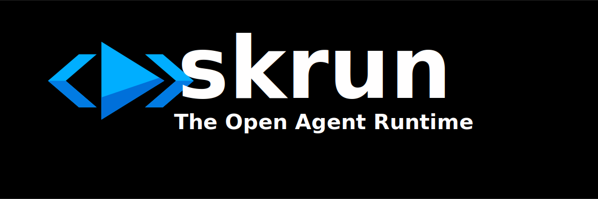

<p align="center">
  
</p>

<h1 align="center">Skrun</h1>

<p align="center">
  <b>Deploy any Agent Skill as an API via <code>POST /run</code>.</b><br>
  The open-source, multi-model agent runtime — works with any LLM.
</p>

<p align="center">
  <i>Self-hostable alternative to Claude Managed Agents, Microsoft Foundry Agent Service, and Mistral + Koyeb.</i>
</p>

<p align="center">
  <a href="https://github.com/skrun-dev/skrun/actions"></a>
  <a href="https://www.npmjs.com/package/@skrun-dev/cli"></a>
  <a href="https://www.npmjs.com/package/@skrun-dev/sdk"></a>
  <a href="https://github.com/skrun-dev/skrun/stargazers"></a>
  <a href="LICENSE"></a>
</p>

<p align="center">
  
  
  
</p>

<p align="center">
  <a href="#-quick-start">Quick Start</a> ·
  <a href="#-sdk">SDK</a> ·
  <a href="#-features">Features</a> ·
  <a href="docs/api.md">API Reference</a> ·
  <a href="#-demo-agents">Examples</a> ·
  <a href="CONTRIBUTING.md">Contributing</a>
</p>

---

## 🎯 Why Skrun?

Every major LLM provider is building their own agent runtime — locked to their models. Skrun is the **open alternative**: same agent, any LLM, your infrastructure, zero lock-in.

| | Skrun | Vendor runtimes (Claude Managed Agents, Foundry, Koyeb) |
|--|-------|-----------------|
| **Models** | Anthropic, OpenAI, Google, Mistral, Groq, DeepSeek, Kimi, Qwen + any OpenAI-compatible endpoint | One provider only |
| **Deployment** | Self-hosted or cloud (coming soon) | Vendor cloud only |
| **Format** | [Agent Skills](https://agentskills.io) (SKILL.md) — works with Claude Code, Copilot, Codex | Proprietary |
| **Streaming** | SSE + async webhooks | Varies |
| **Open source** | MIT | No |
| **Caller-pays LLM** | Users bring their own keys — zero cost for operators | Vendor bills you |

---

## 🚀 Quick Start

```bash
npm install -g @skrun-dev/cli

skrun init --from-skill ./my-skill    # import an existing skill
skrun deploy                           # build + push + get your API endpoint
```

That's it. Your agent is now callable via `POST /run`:

```bash
curl -X POST http://localhost:4000/api/agents/dev/my-skill/run \
  -H "Authorization: Bearer dev-token" \
  -H "Content-Type: application/json" \
  -d '{"input": {"query": "analyze this"}}'
```

---

## ✨ Features

| Feature | Description |
|---------|-------------|
| 🤖 **Multi-model** | 5 built-in providers + any OpenAI-compatible endpoint (DeepSeek, Kimi, Qwen, Ollama, vLLM...) — with automatic fallback |
| 📡 **Streaming** | SSE real-time events (`run_start` → `tool_call` → `run_complete`) + async webhooks |
| 📦 **Typed SDK** | `npm install @skrun-dev/sdk` — `run()`, `stream()`, `runAsync()` + 6 more methods |
| 🔧 **Tool calling** | Local scripts (`scripts/`) + MCP servers (`npx`) — same ecosystem as Claude Desktop |
| 💾 **Stateful** | Agents remember across runs via key-value state |
| 📖 **Interactive docs** | OpenAPI 3.1 schema + Scalar explorer at `GET /docs` |
| 🔑 **Caller keys** | Users bring their own LLM keys via `X-LLM-API-Key` — zero cost for operators |
| ✅ **Agent verification** | Verified flag controls script execution — safe for third-party agents |
| 📌 **Version pinning** | Pin a specific agent version per call (`version: "1.2.0"`) — stable integrations, reproducible runs, no silent drift |
| 📊 **Structured logs** | JSON to stdout via pino — pipe to Axiom, Datadog, ELK. `LOG_LEVEL` env var controls verbosity |
| 🌍 **Environment separation** | Agent behavior (model, tools) separated from runtime environment (networking, timeout, sandbox). Per-run overrides via POST /run body |
| 📁 **Files API** | Agents produce files (PDF, images, data) — callers download via `GET /api/runs/:run_id/files/:filename` |

---

## 📦 SDK

```bash
npm install @skrun-dev/sdk
```

```typescript
import { SkrunClient } from "@skrun-dev/sdk";

const client = new SkrunClient({
  baseUrl: "http://localhost:4000",
  token: "dev-token",
});

// Sync — get the result
const result = await client.run("dev/code-review", { code: "const x = 1;" });
console.log(result.output);

// Stream — real-time events
for await (const event of client.stream("dev/code-review", { code: "..." })) {
  console.log(event.type); // run_start, tool_call, llm_complete, run_complete
}

// Async — fire and forget with webhook callback
const { run_id } = await client.runAsync("dev/agent", input, "https://your-app.com/hook");

// Pin a specific agent version — reproducible, no silent drift
const pinned = await client.run("dev/code-review", input, { version: "1.2.0" });
console.log(pinned.agent_version); // "1.2.0" — always echoed back
```

9 methods: `run`, `stream`, `runAsync`, `push`, `pull`, `list`, `getAgent`, `getVersions`, `verify`. **Zero runtime dependencies**, Node.js 18+.

---

## 🧪 Demo Agents

All examples use Google Gemini Flash by default. Change the `model` section in `agent.yaml` to use any [supported provider](#-features).

| Agent | What it shows |
|-------|--------------|
| 🔍 [code-review](examples/code-review/) | Import a skill, get a code quality API |
| 📄 [pdf-processing](examples/pdf-processing/) | Tool calling with local scripts |
| 📊 [seo-audit](examples/seo-audit/) | **Stateful** — run twice, it remembers and compares |
| 📈 [data-analyst](examples/data-analyst/) | Typed I/O — CSV in, structured insights out |
| ✉️ [email-drafter](examples/email-drafter/) | Business use case — non-dev API consumer |
| 🌐 [web-scraper](examples/web-scraper/) | **MCP server** — headless browser via @playwright/mcp |

<details>
<summary><b>Try an example locally</b></summary>

```bash
# 1. Start the registry
cp .env.example .env          # add your GOOGLE_API_KEY
pnpm dev:registry              # keep this terminal open

# 2. In another terminal
skrun login --token dev-token
cd examples/code-review
skrun build && skrun push

# 3. Call the agent
curl -X POST http://localhost:4000/api/agents/dev/code-review/run \
  -H "Authorization: Bearer dev-token" \
  -H "Content-Type: application/json" \
  -d '{"input": {"code": "function add(a,b) { return a + b; }"}}'
```

> **Windows (PowerShell):** use `curl.exe` instead of `curl`, and use `@input.json` for the body.

</details>

---

## 💻 CLI

| Command | Description |
|---------|-------------|
| `skrun init [dir]` | Create a new agent |
| `skrun init --from-skill <path>` | Import existing skill |
| `skrun dev` | Local server with POST /run |
| `skrun test` | Run agent tests |
| `skrun build` | Package `.agent` bundle |
| `skrun deploy` | Build + push + live URL |
| `skrun push` / `pull` | Registry upload/download |
| `skrun login` / `logout` | Authentication |
| `skrun logs <agent>` | Execution logs |

---

## 🧠 Key Concepts

- **[Agent Skills](https://agentskills.io)** — SKILL.md standard, compatible with Claude Code, Copilot, Codex
- **[agent.yaml](docs/agent-yaml.md)** — Runtime config: model, inputs/outputs, environment, state, tests
- **[POST /run](docs/api.md)** — Every agent is an API. Typed inputs, structured outputs.

---

## 📚 Documentation

- 🌐 **[Interactive API explorer](http://localhost:4000/docs)** — live "Try it" interface (start the registry first)
- 📋 **[OpenAPI schema](http://localhost:4000/openapi.json)** — import into Postman/Insomnia
- 📖 [API reference](docs/api.md)
- 🔧 [`agent.yaml` specification](docs/agent-yaml.md)
- 💻 [CLI reference](docs/cli.md)
- 🤝 [Contributing](CONTRIBUTING.md)
- 📝 [Changelog](CHANGELOG.md)

---

## 🏗️ Use Cases

- 🔁 **Turn any skill into a production API** in under 2 minutes — no infra setup
- 🏢 **Build internal AI tools** (code review, data analysis, email drafting, SEO audits...) with typed inputs/outputs
- 🔒 **Run untrusted agents safely** with verification + permission flags
- 💰 **Offer agents as a product** — users bring their own LLM keys, you host the runtime
- 🌍 **Self-host on any cloud** — Fly.io, AWS, GCP, bare metal — no vendor lock-in
- 🧩 **Compose agents** with MCP servers — same ecosystem as Claude Desktop

---

## 👥 Community

- 💬 [GitHub Discussions](https://github.com/skrun-dev/skrun/discussions) — ask questions, share agents
- 🐛 [Issues](https://github.com/skrun-dev/skrun/issues) — report bugs, request features
- ⭐ [Star the repo](https://github.com/skrun-dev/skrun) if you like the project!

---

## 🤝 Contributing

```bash
git clone https://github.com/skrun-dev/skrun.git
cd skrun
pnpm install && pnpm build && pnpm test
```

See [CONTRIBUTING.md](CONTRIBUTING.md) for conventions and setup.

---

## 📜 License

[MIT](LICENSE) — free to use, modify, self-host, and build on top.

<p align="center">
  <sub>Built with ❤️ for the open agent ecosystem.</sub>
</p>
