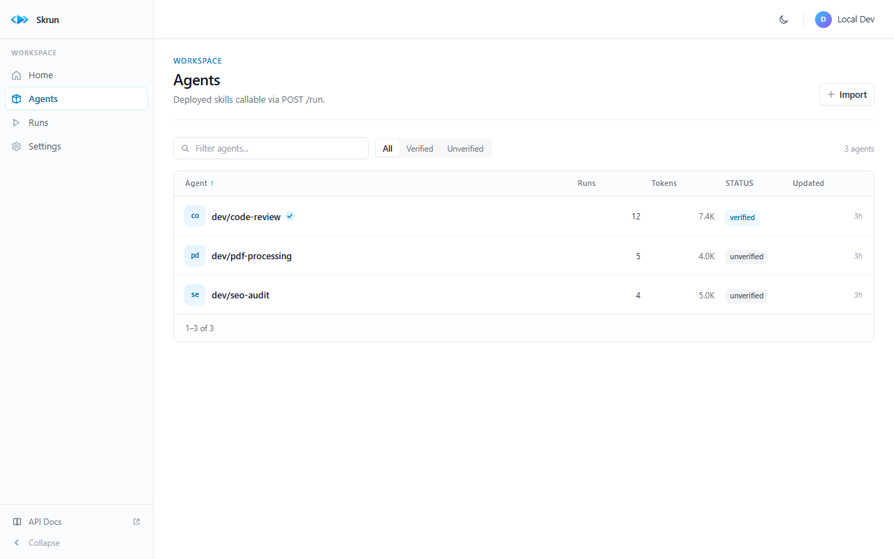
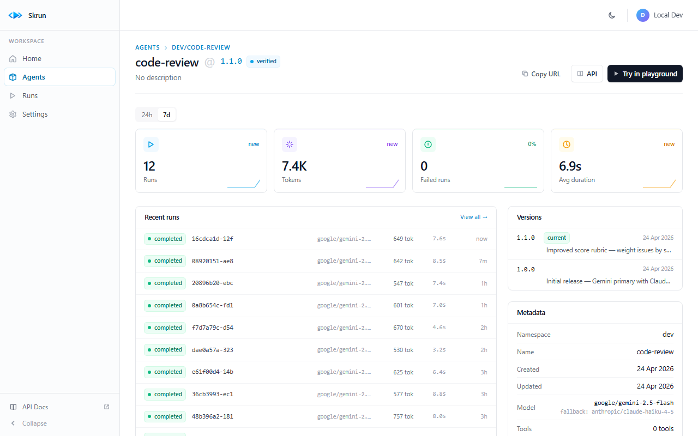
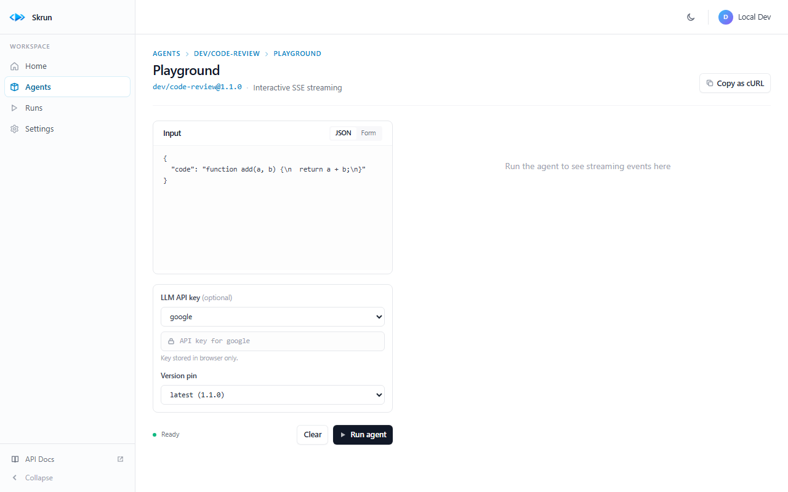
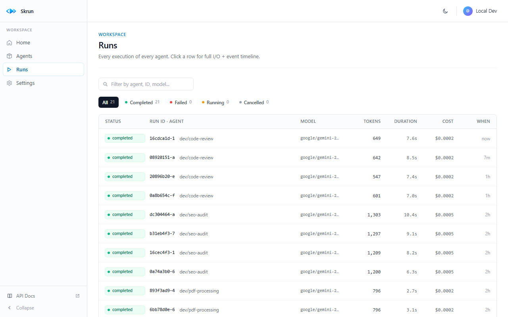
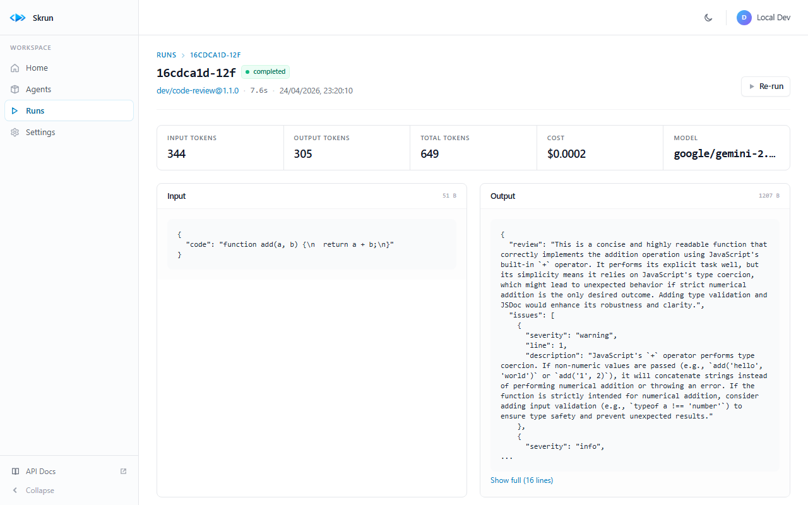
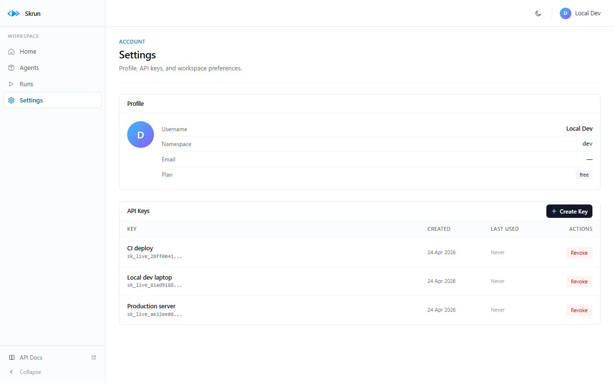

# Getting Started

A 10-minute walkthrough: install Skrun, build your first agent, explore the dashboard, and call your agent from code.

> → New to Skrun? Read [Concepts](./concepts.md) first for the vocabulary (agent, skill, run, namespace…).
> → Deploying to production? Jump to [Self-hosting](./self-hosting.md) when you're done.

---

## Prerequisites

- **Node.js ≥ 20** and **pnpm ≥ 9** (or npm/yarn — the CLI works with any, pnpm is the recommended one)
- A terminal and a text editor
- Optional: one LLM API key (Google Gemini has a free tier and is used by all demo agents — grab one at [aistudio.google.com](https://aistudio.google.com/apikey))

Verify:

```bash
node --version   # v20+ required
pnpm --version   # 9+ recommended
```

---

## 1. Install the CLI

```bash
npm install -g @skrun-dev/cli
```

Verify:

```bash
skrun --version
```

---

## 2. Create your first agent

Scaffold a new agent:

```bash
skrun init my-agent
cd my-agent
```

This creates three files:

- `SKILL.md` — the instructions your agent follows. This is the "brain". Edit it to describe what the agent does and how it should behave.
- `agent.yaml` — the runtime config. Declares the LLM, inputs/outputs, environment, tests. See the [full reference](./agent-yaml.md).
- `scripts/` (optional) — local tools the agent can call. Any language that reads stdin and writes stdout.

Open `SKILL.md` and `agent.yaml` in your editor. For this tutorial we'll keep the defaults — a simple echo agent that returns the input.

> **Importing an existing skill?** Use `skrun init --from-skill ./my-existing-skill` instead. Skrun copies the SKILL.md and wraps it with a default `agent.yaml` — see [Concepts → Skill](./concepts.md#skill).

---

## 3. Iterate locally with `skrun dev`

```bash
skrun dev
```

Starts a local HTTP server on port 3000 with a mock LLM — no real calls, no cost. POST to it while you iterate on `SKILL.md`:

```bash
curl -X POST http://localhost:3000/run \
  -H "Content-Type: application/json" \
  -d '{"input": {"query": "hello"}}'
```

The file watcher auto-reloads on changes to `SKILL.md` and `agent.yaml`. Useful for shaping the prompt and debugging the integration (curl, frontend, SDK) before spending LLM tokens.

---

## 4. Validate with `skrun test`

`agent.yaml` can declare inline tests:

```yaml
tests:
  - name: basic
    input:
      query: "hello"
    assert: output.result != null
```

Run them against a real LLM:

```bash
# Set your LLM key (Google free tier recommended)
export GOOGLE_API_KEY=your_key_here

skrun test
```

This validates each test case with real inference. Use it as a smoke test before pushing.

---

## 5. Deploy your agent

Start a local registry in a second terminal:

```bash
pnpm dev:registry
```

The registry runs on `http://localhost:4000` and uses SQLite by default (persistent, no setup needed — see [Concepts → Namespace](./concepts.md#namespace)).

Login and deploy:

```bash
skrun login --token dev-token
skrun deploy -m "Initial release"
```

`deploy` runs the full pipeline: build → push → print the live URL. The `-m` flag attaches a note to this version (like a git commit message) — you'll see it later in the dashboard.

Output:

```
✓ Pushed dev/my-agent@1.0.0
🚀 Deployed! Your agent is live:

  POST http://localhost:4000/api/agents/dev/my-agent/run
```

---

## 6. Explore the dashboard

Open `http://localhost:4000/dashboard` in your browser.


The **Home** page shows workspace-wide stats (active agents, runs today, tokens, failed runs) with 24h/7d toggles, a recent activity feed, top agents by volume, and a quick-start card.

### Agents list



The **Agents** page lists every deployed agent with run counts, token usage, and verification status. Filter by name, sort by any column.

### Agent detail



Click an agent to see its **Agent detail** page. Key sections:

- **Stats strip** — runs, tokens, failed, avg duration (24h or 7d).
- **Recent runs** — last 10 runs with model, tokens, duration, cost, status.
- **Versions** — every version with its note (the `-m` message you attached at push time). Click a version to target it specifically.
- **Metadata** — namespace, name, model (with fallback), tools, timeout, created/updated.
- **Try it** — inline curl snippet + link to the playground.

### Playground



The **Playground** lets you call the agent interactively. JSON editor (or generated form), LLM key input, version pin, and a Run button that opens an SSE stream. You see the events in real-time and the final result below.

### Runs + run detail



The **Runs** page lists every execution across all agents, filterable by agent, ID, or model. Status chips let you jump to failed/running/cancelled.



Click a run to see its **Run detail** — tokens, cost, model, duration, full input and output JSON, and the event timeline (tool calls, LLM calls, completion). Useful for debugging.

### Settings



**Settings** — your profile (username, namespace, email, plan) and API keys (`sk_live_*` for production) with one-shot reveal, revocation, and last-used timestamps.

---

## 7. Call your agent from code

### curl

```bash
curl -X POST http://localhost:4000/api/agents/dev/my-agent/run \
  -H "Authorization: Bearer dev-token" \
  -H "Content-Type: application/json" \
  -d '{"input": {"query": "hello from code"}}'
```

### TypeScript SDK

```bash
npm install @skrun-dev/sdk
```

```ts
import { SkrunClient } from "@skrun-dev/sdk";

const client = new SkrunClient({
  baseUrl: "http://localhost:4000",
  token: "dev-token",
});

// Sync
const result = await client.run("dev/my-agent", { query: "hello" });
console.log(result.output);

// Stream
for await (const event of client.stream("dev/my-agent", { query: "hello" })) {
  console.log(event.type, event);
}

// Async with webhook
const { run_id } = await client.runAsync(
  "dev/my-agent",
  { query: "hello" },
  "https://your-app.com/callback",
);
```

See the [SDK README](https://www.npmjs.com/package/@skrun-dev/sdk) for all 9 methods.

---

## What's next

- **Ship to production** — [Self-hosting guide](./self-hosting.md) (OAuth, Supabase, reverse proxy) or wait for the managed cloud at `skrun.sh`.
- **Build a stateful agent** — see [Concepts → State](./concepts.md#state) and the [`meeting-transcript-to-action-items`](../agents/meeting-transcript-to-action-items/) example, which maintains an open-actions ledger across runs (run after each meeting and prior actions auto-resolve when next transcript mentions them as done).
- **Produce downloadable artifacts** — see the [`csv-to-executive-report`](../agents/csv-to-executive-report/) example which turns a CSV into a multi-page PDF with charts, or [`knowledge-base-from-vault`](../agents/knowledge-base-from-vault/) which bundles a Markdown vault into a navigable HTML site as a `.zip` artifact.
- **Add MCP tools** — connect to Slack, GitHub, a headless browser, etc. See [Concepts → MCP](./concepts.md#mcp) and the [`web-scraper` example](../agents/web-scraper/).
- **Pin a specific version** — for reproducible integrations, pass `{ version: "1.2.0" }` in the POST /run body. See [API → Run an agent](./api.md#run-an-agent).
- **Deep dive on config** — [`agent.yaml` reference](./agent-yaml.md) documents every field.
